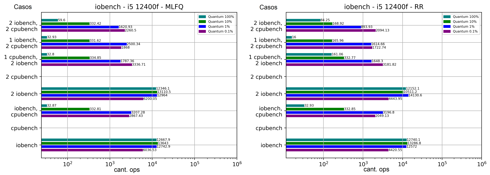
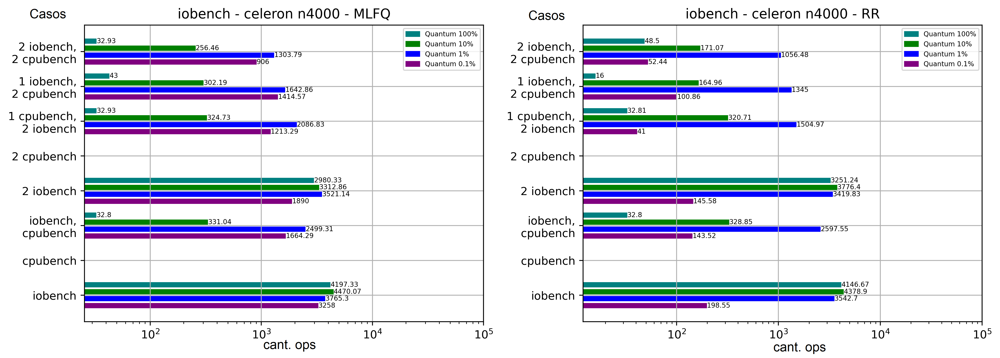
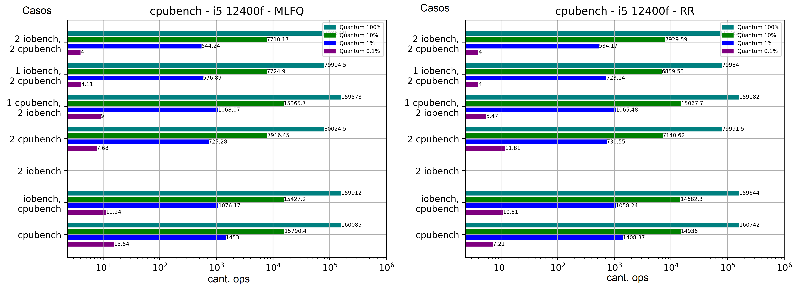

[TOC]

# Estructura del análisis
## Problema
Comparar el desempeño de los planificadores Round Robin (por defecto en XV6) y MLFQ (implementado por nosotros), utilizando procesos CPU-bound e IO-bound en XV6 y contrastando también los diferentes tamaños de quantum en cada caso.

## Hipótesis
El planificador MLFQ mejorará el desempeño en los procesos IO-bound y empeorará un poquito el desempeño de los procesos CPU-bound.
En general en los casos, mientras menor sea el quantum, mejor desempeño tendrán los procesos IO-bound y peor desempeño los procesos CPU-bound. 

## Datos
Para responder a nuestras hipótesis, mediremos diferentes datos para los procesos IO-bound y los procesos CPU-bound.
Para los procesos IO-bound mediremos cuantas operaciones IO se realizaron (en promedio) durante un lapso de 100 (MINTICKS=100) ticks de reloj.
Para los procesos CPU-bound mediremos cuantas "1024 operaciones de punto flotante" (KFLOP) se realizaron (en promedio) durante un lapso de 100 (MINTICKS=100) ticks de reloj.

## Experimento
Vamos a ejecutar diferentes casos en diferentes escenarios donde mediremos los datos de los procesos IO-bound y los procesos CPU-bound.
Las mediciones se realizarán (aproximadamente) cada 100 (MINTICKS=100) ticks de reloj, para cada proceso en ejecución durante el caso. 
Todos los casos en los distintos escenarios se ejecutan durante 5 minutos en dos equipos, para analizar si se ve un mayor cambio en un procesador potente o en uno de menores recursos. Los equipos cuentan con las siguientes caracteristicas: 

- i5 12400f y 16GB de RAM / Celeron N4000 y 4GB de RAM
- Desconectado de internet
- Cantidad mínima de procesos en ejecución en el sistema, además de QEMU y otros procesos necesarios para realizar el experimento

En cada caso, las mediciones de cada proceso se promediaran para luego analizarse.

### Casos
- **Caso 0**: 1 iobench solo. En este caso queremos investigar como se comporta un solo proceso iobench corriendo solo (sin otros procesos en paralelo) en xv6.
- **Caso 1**: 1 cpubench solo. En este caso queremos investigar como se comporta un solo proceso cpubench corriendo solo (sin otros procesos en paralelo) en xv6. 
- **Caso 2**: 1 iobench con 1 cpubench. En este caso queremos investigar como se comporta un solo proceso iobench corriendo cuando además esta corriendo otro poceso cpubench en paralelo en xv6. (En este mismo Caso podemos ver como se comporta 1 cpubench cuando en paralelo corre 1 iobench)
- **Caso 3**: 1 iobench con 1 iobench. En este caso queremos investigar como se comporta un solo proceso iobench corriendo cuando además esta corriendo otro poceso iobench en paralelo en xv6.
- **Caso 4**: 1 cpubench con 1 cpubench. En este caso queremos investigar como se comporta un solo proceso cpubench corriendo cuando además esta corriendo otro pocesos cpubench en paralelo en xv6.
- **\*Caso 5**: 1 cpubench con 2 iobench. En este caso queremos investigar como se comporta un solo proceso cpubench corriendo cuando además estan corriendo otros 2 pocesos iobench en paralelo en xv6. (Con este mismo Caso podemos ver como se comporta 1 iobench cuando en paralelo corren 1 iobench y otro cpubench)
- **\*Caso 6**: 1 iobench con 2 cpubench. En este caso queremos investigar como se comporta un solo proceso iobench corriendo cuando además estan corriendo otros 2 pocesos cpubench en paralelo en xv6. (En este mismo Caso podemos ver como se comporta 1 cpubench cuando en paralelo corren 1 iobench y otro cpubench)
- **\*Caso 7**: 1 iobench con 2 cpubench y 1 iobench. En este caso queremos investigar como se comporta un solo proceso iobench corriendo cuando además estan corriendo otros 2 pocesos cpubench y otro proceso iobench en paralelo en xv6. (Con este mismo Caso podemos ver como se comporta 1 cpubench cuando en paralelo corren 2 iobench y otro cpubench)

###  Escenarios
- **Escenario 0**: quantum por defecto 
- **Escenario 1**: quantum 10 veces más corto (Para mantener un comportamiento similar en las mediciones, el valor de MINTICKS es 10 veces más largo)
- **Escenario 2**: quantum 100 veces más corto (Para mantener un comportamiento similar en las mediciones, el valor de MINTICKS es 100 veces más largo)
- **Escenario 3**: quantum 1000 veces más corto (Para mantener un comportamiento similar en las mediciones, el valor de MINTICKS es 1000 veces más largo)

# Resultados del experimento 

## Mediciones RR (i5 12400f)

### Caso 0: 1 iobench solo

| Escenario                    | 0 | 1 | 2 | 3 |
|------------------------------|---|---|---|---|
| Prom. de ops IO en intervalo |12740.13|13286.8|12572.03|4420.55|

### Caso 1: 1 cpubench solo

| Escenario                     | 0 | 1 | 2 | 3 |
|-------------------------------|---|---|---|---|
| Prom. de ops CPU en intervalo | 160742.0 | 14936.03 | 1408.37 | 7.21 |

### Caso 2: 1 iobench y 1 cpubench

| Escenario                     | 0 | 1 | 2 | 3 |
|-------------------------------|---|---|---|---|
| Prom. de ops CPU en intervalo | 159644.43 | 14682.3 | 1058.24 | 10.81 |
| Prom. de ops IO en intervalo  | 32.93 | 332.85 | 3196.8 | 2049.13 |

### Caso 3: 1 iobench con 1 iobench

| Escenario                              | 0 | 1 | 2 | 3 |
|----------------------------------------|---|---|---|---|
| Prom. de ops IO (proc. A) en intervalo | 12554.33 | 10508.76 | 14064.62 | 4213.14 |
| Prom. de ops IO (proc. B) en intervalo | 12152.07 | 10511.2 | 14130.6 | 4443.95 |

### Caso 4: 1 cpubench con 1 cpubench

| Escenario                               | 0 | 1 | 2 | 3 |
|-----------------------------------------|---|---|---|---|
| Prom. de ops CPU (proc. A) en intervalo | 80132.63 | 7134.23 | 717.1 | 3.43 |
| Prom. de ops CPU (proc. B) en intervalo | 79991.46 | 7140.62 | 730.55 | 11.81 |

### Caso 5: 1 cpubench con 2 iobench

| Escenario                     | 0 | 1 | 2 | 3 |
|-------------------------------|---|---|---|---|
| Prom. de ops CPU en intervalo | 159182.48 | 15067.7 | 1065.48 | 5.47 |
| Prom. de ops IO (proc. A) en intervalo  | 161.06 | 332.77 | 1711.52 | 3301.78 |
| Prom. de ops IO (proc. B) en intervalo  | - | - | 1648.3 | 3181.82 |

*La simbología "-" significa que no fueron registrados datos de ese proceso durante el periodo de tiempo que duro la medición

### Caso 6: 1 iobench con 2 cpubench

| Escenario                     | 0 | 1 | 2 | 3 |
|-------------------------------|---|---|---|---|
| Prom. de ops IO en intervalo  | 16.0 | 165.96 | 1614.66 | 1722.74 |
| Prom. de ops CPU (proc. A) en intervalo | 79871.21 | 7100.93 | 537.7 | 6.0 |
| Prom. de ops CPU (proc. B) en intervalo | 79983.97 | 6859.53 | 723.14 | 4.0 |

### Caso 7: 1 iobench con 2 cpubench y 1 iobench

| Escenario                     | 0 | 1 | 2 | 3 |
|-------------------------------|---|---|---|---|
| Prom. de ops IO (proc. A) en intervalo  | 84.25 | 168.92 | 854.86 | 2071.52 |
| Prom. de ops IO (proc. B) en intervalo  | - | - | 893.93 | 2094.13 |
| Prom. de ops CPU (proc. A) en intervalo | 79557.67 | 7728.93 | 718.34 | 5.0 |
| Prom. de ops CPU (proc. B) en intervalo | 79732.38 | 7929.59 | 534.17 | 4.0 |

*La simbología "-" significa que no fueron registrados datos de ese proceso durante el periodo de tiempo que duro la medición

## Mediciones MLFQ sin priority boost (i5 12400f)

### Caso 0: 1 iobench solo

| Escenario                    | 0 | 1 | 2 | 3 |
|------------------------------|---|---|---|---|
| Prom. de ops IO en intervalo |12667.87|13643.03|12742.87|6036.53|

### Caso 1: 1 cpubench solo

| Escenario                     | 0 | 1 | 2 | 3 |
|-------------------------------|---|---|---|---|
| Prom. de ops CPU en intervalo | 160084.93 | 15790.43 | 1453.0 | 15.54 |

### Caso 2: 1 iobench y 1 cpubench

| Escenario                     | 0 | 1 | 2 | 3 |
|-------------------------------|---|---|---|---|
| Prom. de ops CPU en intervalo | 159911.5 | 15790.43 | 1076.17 | 11.24 |
| Prom. de ops IO en intervalo  | 32.87 | 332.81 | 3207.28 | 2867.43 |

### Caso 3: 1 iobench con 1 iobench

| Escenario                              | 0 | 1 | 2 | 3 |
|----------------------------------------|---|---|---|---|
| Prom. de ops IO (proc. A) en intervalo | 12300.1 | 13078.93 | 13048.1 | 6183.55 |
| Prom. de ops IO (proc. B) en intervalo | 12346.1 | 13110.55 | 12964.03 | 6200.05 |

### Caso 4: 1 cpubench con 1 cpubench

| Escenario                               | 0 | 1 | 2 | 3 |
|-----------------------------------------|---|---|---|---|
| Prom. de ops CPU (proc. A) en intervalo | 80053.03 | 7921.87 | 724.37 | 7.5 |
| Prom. de ops CPU (proc. B) en intervalo | 80024.5 | 7916.45 | 725.28 | 7.68 |

### Caso 5: 1 cpubench con 2 iobench

| Escenario                     | 0 | 1 | 2 | 3 |
|-------------------------------|---|---|---|---|
| Prom. de ops CPU en intervalo | 159573.4 | 15365.67 | 1068.07 | 9.0 |
| Prom. de ops IO (proc. A) en intervalo  | 32.8 | 334.85 | 1741.19 | 3330.36 |
| Prom. de ops IO (proc. B) en intervalo  | - | - | 1787.36 | 3336.71 |

*La simbología "-" significa que no fueron registrados datos de ese proceso durante el periodo de tiempo que duro la medición

### Caso 6: 1 iobench con 2 cpubench

| Escenario                     | 0 | 1 | 2 | 3 |
|-------------------------------|---|---|---|---|
| Prom. de ops IO en intervalo  | 32.93 | 331.62 | 2500.34 | 1868.0 |
| Prom. de ops CPU (proc. A) en intervalo | 80268.57 | 7725.07 | 579.79 | 4.9 |
| Prom. de ops CPU (proc. B) en intervalo | 79994.52 | 7731.73 | 576.89 | 4.11 |

### Caso 7: 1 iobench con 2 cpubench y 1 iobench

| Escenario                     | 0 | 1 | 2 | 3 |
|-------------------------------|---|---|---|---|
| Prom. de ops IO (proc. A) en intervalo  | 59.6 | 332.42 | 1732.08 | 2242.09 |
| Prom. de ops IO (proc. B) en intervalo  | - | - | 1620.93 | 2260.5 |
| Prom. de ops CPU (proc. A) en intervalo | 79718.9 | 7731.73 | 542.76 | 4.53 |
| Prom. de ops CPU (proc. B) en intervalo | 79867.9 | 7710.17 | 544.24 | 4.0 |

*La simbología "-" significa que no fueron registrados datos de ese proceso durante el periodo de tiempo que duro la medición

## Mediciones RR (celeron n4000)

### Caso 0: 1 iobench solo

| Escenario                    | 0 | 1 | 2 | 3 |
|------------------------------|---|---|---|---|
| Prom. de ops IO en intervalo |4146.67|4378.9|3542.7|198.55|

### Caso 1: 1 cpubench solo

| Escenario                     | 0 | 1 | 2 | 3 |
|-------------------------------|---|---|---|---|
| Prom. de ops CPU en intervalo | 30514.9 | 2980.0 | 216.47 | 0.0 |

### Caso 2: 1 iobench y 1 cpubench

| Escenario                     | 0 | 1 | 2 | 3 |
|-------------------------------|---|---|---|---|
| Prom. de ops CPU en intervalo | 30267.67 | 2740.07 | 51.92 | 0.0 |
| Prom. de ops IO en intervalo  | 32.8 | 328.85 | 2597.55 | 143.52 |

### Caso 3: 1 iobench con 1 iobench

| Escenario                              | 0 | 1 | 2 | 3 |
|----------------------------------------|---|---|---|---|
| Prom. de ops IO (proc. A) en intervalo | 3463.41 | 3622.83 | 3413.41 | 152.74 |
| Prom. de ops IO (proc. B) en intervalo | 3251.24 | 3776.4 | 3419.83 | 145.58 |

### Caso 4: 1 cpubench con 1 cpubench

| Escenario                               | 0 | 1 | 2 | 3 |
|-----------------------------------------|---|---|---|---|
| Prom. de ops CPU (proc. A) en intervalo | 15284.62 | 1491.32 | 115.11 | 0.0 |
| Prom. de ops CPU (proc. B) en intervalo | 15267.0 | 1482.0 | 108.0 | 0.0 |

### Caso 5: 1 cpubench con 2 iobench

| Escenario                     | 0 | 1 | 2 | 3 |
|-------------------------------|---|---|---|---|
| Prom. de ops CPU en intervalo | 30282.41 | 2720.83 | 65.52 | 0.0 |
| Prom. de ops IO (proc. A) en intervalo  | 32.81 | 318.62 | 1609.62 | 54.02 |
| Prom. de ops IO (proc. B) en intervalo  | - | 320.71 | 1504.97 | 48.87 |

*La simbología "-" significa que no fueron registrados datos de ese proceso durante el periodo de tiempo que duro la medición

### Caso 6: 1 iobench con 2 cpubench

| Escenario                     | 0 | 1 | 2 | 3 |
|-------------------------------|---|---|---|---|
| Prom. de ops IO en intervalo  | 16.0 | 164.96 | 1345.0 | 100.86 |
| Prom. de ops CPU (proc. A) en intervalo | 15274.55 | 1369.45 | 104.73 | 0.0 |
| Prom. de ops CPU (proc. B) en intervalo | 15133.79 | 1487.41 | 27.9 | 0.0 |

### Caso 7: 1 iobench con 2 cpubench y 1 iobench

| Escenario                     | 0 | 1 | 2 | 3 |
|-------------------------------|---|---|---|---|
| Prom. de ops IO (proc. A) en intervalo  | 48.5 | 154.73 | 845.17 | 61.67 |
| Prom. de ops IO (proc. B) en intervalo  | - | 171.07 | 1056.48 | 52.44 |
| Prom. de ops CPU (proc. A) en intervalo | 15229.38 | 1363.97 | 100.04 | 0.0 |
| Prom. de ops CPU (proc. B) en intervalo | 15098.79 | 1481.33 | 32.17 | 0.0 |

*La simbología "-" significa que no fueron registrados datos de ese proceso durante el periodo de tiempo que duro la medición

## Mediciones MLFQ sin priority boost (celeron n4000)

### Caso 0: 1 iobench solo

| Escenario                    | 0 | 1 | 2 | 3 |
|------------------------------|---|---|---|---|
| Prom. de ops IO en intervalo |4197.33|4470.07|3765.3|3258.0|

### Caso 1: 1 cpubench solo

| Escenario                     | 0 | 1 | 2 | 3 |
|-------------------------------|---|---|---|---|
| Prom. de ops CPU en intervalo | 30223.33 | 2988.6 | 223.5 | 0.0 |

### Caso 2: 1 iobench y 1 cpubench

| Escenario                     | 0 | 1 | 2 | 3 |
|-------------------------------|---|---|---|---|
| Prom. de ops CPU en intervalo | 30261.33 | 2749.66 | 66.68 | 0.0 |
| Prom. de ops IO en intervalo  | 32.8 | 331.04 | 2499.31 | 1664.29 |

### Caso 3: 1 iobench con 1 iobench

| Escenario                              | 0 | 1 | 2 | 3 |
|----------------------------------------|---|---|---|---|
| Prom. de ops IO (proc. A) en intervalo | 3364.83 | 3496.38 | 3523.07 | 1900.5 |
| Prom. de ops IO (proc. B) en intervalo | 2980.33 | 3312.86 | 3521.14 | 1890.0 |

### Caso 4: 1 cpubench con 1 cpubench

| Escenario                               | 0 | 1 | 2 | 3 |
|-----------------------------------------|---|---|---|---|
| Prom. de ops CPU (proc. A) en intervalo | 14970.37 | 1488.81 | 113.79 | 0.0 |
| Prom. de ops CPU (proc. B) en intervalo | 14988.21 | 1495.63 | 113.9 | 0.0 |

### Caso 5: 1 cpubench con 2 iobench

| Escenario                     | 0 | 1 | 2 | 3 |
|-------------------------------|---|---|---|---|
| Prom. de ops CPU en intervalo | 29685.23 | 2706.1 | 53.0 | 0.0 |
| Prom. de ops IO (proc. A) en intervalo  | 43.0 | 328.62 | 1679.55 | 1380.83 |
| Prom. de ops IO (proc. B) en intervalo  | - | 302.19 | 1642.86 | 1414.57 |

*La simbología "-" significa que no fueron registrados datos de ese proceso durante el periodo de tiempo que duro la medición

### Caso 6: 1 iobench con 2 cpubench

| Escenario                     | 0 | 1 | 2 | 3 |
|-------------------------------|---|---|---|---|
| Prom. de ops IO en intervalo  | 32.93 | 324.73 | 2086.83 | 1213.29 |
| Prom. de ops CPU (proc. A) en intervalo | 15155.24 | 1370.31 | 47.13 | 0.0 |
| Prom. de ops CPU (proc. B) en intervalo | 15133.79 | 1376.17 | 45.77 | 0.0 |

### Caso 7: 1 iobench con 2 cpubench y 1 iobench

| Escenario                     | 0 | 1 | 2 | 3 |
|-------------------------------|---|---|---|---|
| Prom. de ops IO (proc. A) en intervalo  | 32.93 | 266.38 | 1324.59 | 900.0 |
| Prom. de ops IO (proc. B) en intervalo  | - | 256.46 | 1303.79 | 906.0 |
| Prom. de ops CPU (proc. A) en intervalo | 15167.31 | 1368.24 | 45.82 | 0.0 |
| Prom. de ops CPU (proc. B) en intervalo | 15138.96 | 1375.61 | 46.3 | 0.0 |

*La simbología "-" significa que no fueron registrados datos de ese proceso durante el periodo de tiempo que duro la medición

## Análisis y gráficos de interes

_**Aclaración**: La escala de los gráficos es logarítmica ya que en escala lineal hay gran cantidad de datos que son imposibles de verlos hasta con una lupa_

_Comparación entre el desempeño de los procesos IO-bond en el planificador MLFQ y el planificador RR en el procesador i5 12400f_

_Comparación entre el desempeño de los procesos IO-bond en el planificador MLFQ y el planificador RR en el procesador Celeron N4000_

_Comparación entre el desempeño de los procesos CPU-bond en el planificador MLFQ y el planificador RR en el procesador i5 12400f_

_Comparación entre el desempeño de los procesos CPU-bond en el planificador MLFQ y el planificador RR en el procesador Celeron N4000_

### Análisis de los diferentes tamaños de quantums

- En el **caso 0** se observa que el mejor escenario para los proceso IO-bond ejecutados de manera solitaria es el **escenario 1**, teniendo resultados ligeramente mejores que los de los **escenarios 0 y 2**. El **escenario 3** da el peor desempeño, debido a lo corto de su quantum. que lo vuelve inviable ya que se pierde mucho desempeño

- En el **caso 1** se observa que se cumplió la hipótesis de que menor quantum implica peor desempeño para los procesos CPU-bond, esto porque mientras más largo el quantum, menor cantidad de tiempo se lo pasa el SO haciendo context switch. El caso más extremo es en el procesador celeron n4000, donde siempre que se utilizo el quantum del **escenario 3**, los procesos CPU-bond no llegaron a realizar ninguna operación.

- En todos los casos, aunque se ve en particular reflejado en el **caso 0 y 1** de RR, el **escenario 3** dio un desempeño lamentable, afectando sobre todo a los procesos CPU-bond al punto de volverlos inutilizables, pero tampoco ayudando demasiado a los procesos IO-bond. Esto puede deberse a que al implementar un quantum tan pequeño, el SO gasta más tiempo realizando los context switch que realmente ejecutando procesos.

- En el **caso 2**, al ejecutar en paralelo un proceso IO-bound y CPU-bound, ambos procesos bajan su desempeño como es de esperar. Los quantums más grandes, como el del **escenario 0**), hacen que el proceso CPU-bound tenga una disminución de desempeño mínima, pero el proceso IO-bound pierde muchisimo desempeño, y los quantums más pequeños (**escenario 2 y 3**) implican que el proceso IO-bond no pierda tanto desempeño pero que el proceso CPU-bond se vea más perjudicado (Comparando con las mediciones de los **casos 0 y 1**)

- En los casos donde se ejecutan procesos IO-bond junto con CPU-bond (**casos 2,5,6 y 7**), el escenario más beneficioso para los procesos IO-bond es generalmente el **escenario 3**, y el más beneficioso para los procesos CPU-bond es generalmente el **escenario 0**, apoyando la hipótesis dicha anteriormente. Sin embargo, varia un poco entre el planificador RR y MLFQ y no es absoluto, ya que en algunos casos el **escenario 2** es más beneficioso que el **escenario 3** para los procesos IO-bond.

- Todas las conclusiones anteriores aplican tanto para el planificador RR como para el MLFQ sin priority boost, ya que los resultados entre ambos planificadores no tienen grandes variaciones.

- Si tuvieramos que seleccionar nuestro quantum ideal para RR, según los experimentos realizados elegiriamos el quantum del **escenario 1**, porque es el más equilibrado según observamos. Beneficia más a los procesos IO-bond que el **escenario 0** y un escenario con quantum más corto reduciría mucho la cantidad de operaciones de los procesos CPU-bond, sobre todo en los procesadores menos potentes (Como el celeron N4000)

- Si tuvieramos que seleccionar nuestro quantum ideal para MLFQ sin priority boost, según los experimentos realizados elegiriamos el quantum del **escenario 1**, porque es el más equilibrado según observamos. Beneficia más a los procesos IO-bond (los cuales ya por el planificador MLFQ se ven bastante más beneficiados que en RR) que el **escenario 0**, y un escenario con quantum más corto reduciría mucho la cantidad de operaciones de los procesos CPU-bond, sobre todo en los procesadores menos potentes (Como el celeron N4000)

### Análisis del desempeño de los procesos al realizar time-sharing

- El funcionamiento del **caso 2** ya fue explicado en la sección anterior

- En el **caso 3** se observa que al ejecutar 2 procesos IO-bond en paralelo, el desempeño de cada proceso es similar a si cada proceso se ejecutara solo en el CPU. Esto se debe a que al hacer las peticiones de IO se van turnando los procesos, y el tiempo que un proceso espera el otro lo aprovecha para realizar cosas en el CPU, aunque cabe aclarar que el desempeño de este caso no depende casi nada del CPU, ya que las pruebas hechas con el i5 y con el intel Celeron dan resultados bastante similares.

- En el **caso 4** se observa que al ejecutar 2 procesos CPU-bound en paralelo, el desempeño de cada proceso baja a la mitad (Respecto al desempeño al ejecutarse un solo proceso individual, en el **caso 1**).

- En el **caso 5** se observa que al ejecutar un proceso CPU-bound en paralelo con 2 procesos IO-bound, el desempeño del proceso CPU-bound es similar a que si se ejecutara con un solo proceso IO-bound en paralelo. Los procesos IO-bound tienen problemas para ejecutarse en simultaneo junto con el proceso CPU-bound, y creemos que uno de los 2 procesos sufre starvation en los escenarios más bajos. Una vez ambos procesos IO-bond nos devuelven mediciones con las cuales poder trabajar, se observa que el desempeño de cada proceso IO-bond es la mitad del desempeño que tendría si se ejecutará un proceso CPU-bond en paralelo con un solo proceso IO-bond (**caso 2**) en el caso del procesador i5 12400f. En el caso del celeron n4000 no se ve que exista tanta diferencia entre el desempeño de los procesos IO-bond del **caso 2** y el **caso 5**. La disminución de desempeño de los procesos IO-bond sucede porque a comparación del **caso 3**, acá los tiempos de espera de IO los aprovecha sobre todo el proceso CPU-bond y una vez obtiene el control del CPU no lo suelta hasta finalizar su quantum (En el **caso 2**, los procesos al ser ambos IO-bond iban soltando el control del CPU de manera alternada y nadie "acaparaba" el uso del CPU).

- En el **caso 6**: Al ejecutar un proceso IO-bound en paralelo con 2 procesos CPU-bound, los procesos CPU-bound tienen un desempeño similar a cuando se ejecutan en paralelo pero sin el proceso IO-bound (**caso 4**). El desempeño del proceso IO-bound disminuye un poco al valor de si se ejecutara en paralelo con 1 solo proceso CPU-bound (**caso 2**). 

- **Caso 7**: Al ejecutar 2 procesos IO-bound en paralelo con 2 procesos CPU-bound, los 2 procesos CPU-bound tienen un desempeño similar a cuando se ejecutan en paralelo pero sin los procesos IO-bound (**caso 4**). Los procesos IO-bound tienen menor desempeño que si solo se ejecutara un proceso IO-bound (**caso 6**).

- Para los análisis anteriores se usaron sobre todo los **escenarios 0, 1 y 2**, ya que el **escenario 3** al tener un quantum tan pequeño genera ciertas mediciones extrañas, además de que luego de todas las mediciones no consideramos que sea viable querer utilizar XV6 con un planificador que tenga el quantum así de pequeño.

- Para los análisis anteriores nos basamos sobre todo en las mediciones del procesador i5 12400f en aquellas situaciones donde existia una gran diferencia (salvando la escala) entre los resultados dados por las mediciones de ambos procesadores.

### Comparación MLFQ vs RR
- En los casos básicos (**casos 0, 1, 2, 3 y 4**) no se ve gran diferencia entre los resultados de los planificadores MLFQ y RR.
- En los casos opcionales (**casos 5, 6 y 7**) si se ve una mayor diferencia, aunque tampoco es muy grande. En esos casos opcionales se ve que los procesos IO-bond tienen una mejor respuesta y desempeño sin que los procesos CPU-bond se vean muy perjudicados, mostrando que el SO los ejecuta mayor cantidad de veces, priorizandolos frente a los procesos CPU-bond y generando un contraste con el planificador RR. Eso puede significar que la mayor diferencia de desempeño entre el planificador MLFQ y RR se presenta al trabajar con una gran cantidad de procesos, como sucede en el día a día de un SO. La mayor parte de nuestras mediciones hechas en los casos de prueba fueron con poca cantidad y eso puede haber propiciado que no exista tanta diferencia entre las mediciones.
- La estructura, forma y simetria de los datos en ambos equipos es bastante similar, y en ambas se ve reflejado como los procesos IO-bond se benefician de la implementación del planificador MLFQ.

# Conclusiones finales
- Se corrobora la hipótesis de que un quantum mayor significa mejor desempeño para los procesos CPU-bond y un quantum más chico mejora el desempeño de los procesos IO-bond (siempre y cuando el quantum no sea demasiado chico).
- Un quantum demasiado chico no ayuda a ningún tipo de proceso, perjudica a todos y obliga al SO a realizar demasiados context switch.
- El quantum por defecto en XV6 es demasiado grande y por lo tanto perjudica a los procesos IO-bond. El quantum ideal (desde nuestro punto de vista) seria el utilizado en el **escenario 1**
- La mayor diferencia de rendimiento entre el procesador MLFQ y RR se presenta cuando aumentamos la cantidad de procesos que el SO debe planificar (**casos 5, 6, 7**)
- Con este análisis esperabamos encontrar diferencias más claras en los datos obtenidos con cada planificador, y aunque nos encontramos con resultados orientados a nuestras hipótesis iniciales, esperabamos una mayor intensidad de mejora. Esta es la gracia de investigar y lo que nos permite (ahora, que sabemos un poquito más de como funcionan los planificadores) acercar nuestras hipótesis y modelos mentales a unos más cercanos a la realidad del SO.
